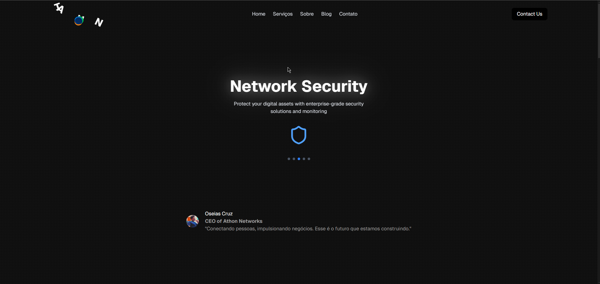

# Docs



*** This is not a conventional documentation, its jut to show the corpative website that I built ***

## Information
- Built with React
- Icons with Lucide icons
- Animation Dev for animations
- Tailwind CSS for styles
- SPA application

## URLs pablodev
- [Perfil on github](https://github.com/Pabloodev)
- [Perfil on linkedin](https://www.linkedin.com/in/pabloteixeiraimproving/)

---
```
I wanted to thank you for this fantastic work that had the chance to participate in, really creating a truly professional website, for a real company and here it is, it still needs improvements but I really liked my result.
